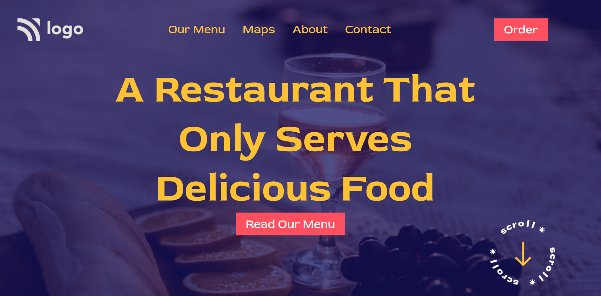

# Hello I am **Devang** and Welcome to Reastaurant Landing Page.

# 💻 Tech Stack Used :

  

 

 ## Project Name : Restaurant Landing Page !

 
This project taught me many things one of which was PATIENCE. I wasn't able to find the blue overlay that is applied in the background then come STACKOVERFLOW came to my resuce learned alot about before after pseudo element only to find out that we can do it much simpler way. Also understood the importance of commenting while writing the code. This project took me one full day to complete and the final output can be seen below.

 
### Do Check it Live on Below Link :

[Live Link !](https://food-retaurant-landing-page.netlify.app/)
